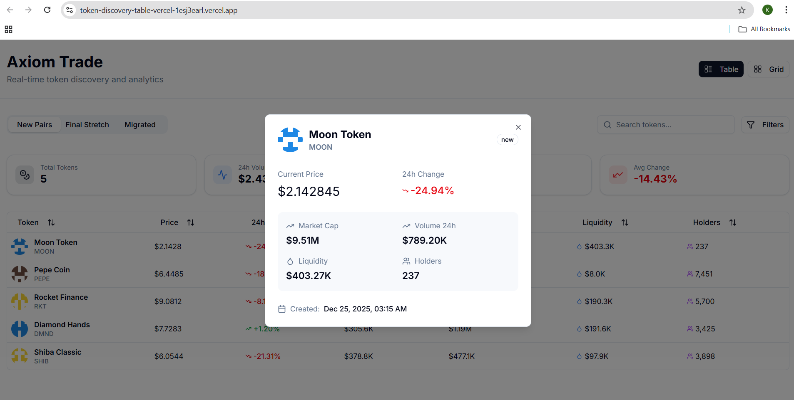
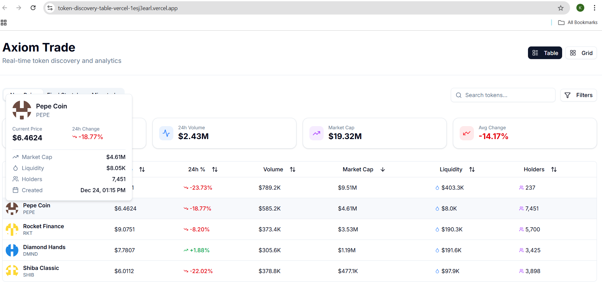
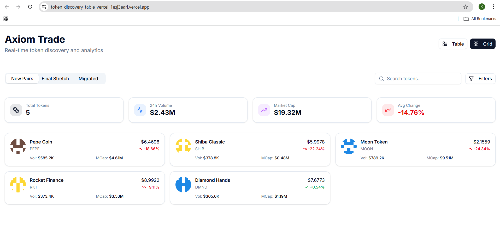
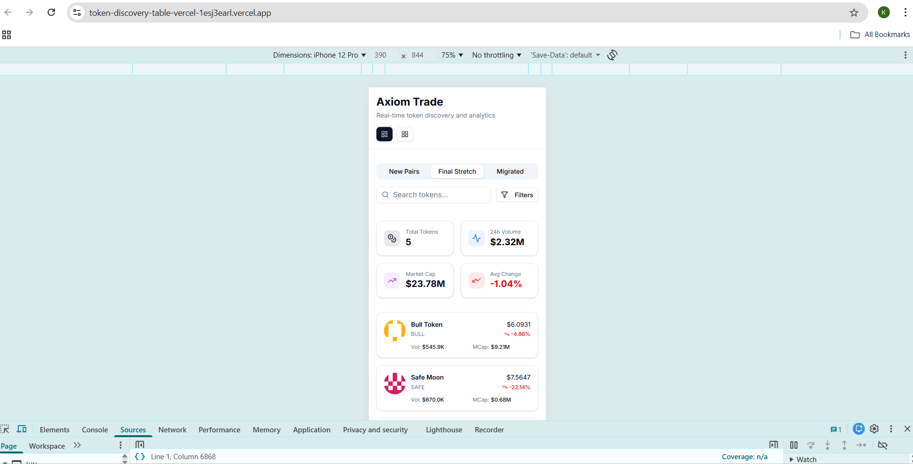

# Token Discovery Table

A modern, high-performance token trading dashboard built with Next.js 14, featuring real-time price updates, advanced filtering, and comprehensive data visualization.

**Live Demo:** [https://token-discovery-table-vercel.vercel.app](https://token-discovery-table-vercel.vercel.app)

**Demo Video:** [Watch on YouTube](https://youtu.be/DFglRJbmY5g)

**GitHub Repository:** [https://github.com/kavi-8055/token-discovery-table](https://github.com/kavi-8055/token-discovery-table)


## Features

### Core Functionality
- Real-time price updates with WebSocket simulation
- Three token categories: New Pairs, Final Stretch, and Migrated
- Column-based sorting for all data fields
- Advanced search and filtering capabilities
- Dual view modes: Table view for desktop, Grid view for mobile
- Interactive hover cards and modals for detailed token information
- Comprehensive statistics dashboard

### Technical Implementation
- Performance optimized with memoized components
- Fully responsive design from 320px to 4K displays
- Type-safe TypeScript implementation with strict mode
- Atomic design architecture for maximum reusability
- Comprehensive error handling and loading states
- Clean, maintainable codebase following best practices

## Technology Stack

**Framework & Language**
- Next.js 14 with App Router
- TypeScript (strict mode)
- React 18

**Styling & UI**
- Tailwind CSS
- Radix UI primitives
- shadcn/ui component library
- Lucide React icons

**State Management**
- Redux Toolkit for global state
- React Query for server state
- Local state management with React hooks

**Build & Deploy**
- Vercel for hosting
- Git for version control

## Getting Started

### Prerequisites
- Node.js 18+ 
- npm or yarn

### Installation

```bash
# Clone the repository
git clone https://github.com/kavi-8055/token-discovery-table.git
cd token-discovery-table

# Install dependencies
npm install

# Run development server
npm run dev
```

Open [http://localhost:3000](http://localhost:3000) to view the application.

### Build for Production

```bash
npm run build
npm start
```

## Project Structure

```
src/
├── app/                      # Next.js app directory
│   ├── page.tsx             # Main dashboard page
│   ├── layout.tsx           # Root layout with providers
│   └── globals.css          # Global styles and animations
├── components/
│   ├── atoms/               # Basic reusable components
│   │   ├── PriceDisplay.tsx
│   │   ├── PercentageChange.tsx
│   │   ├── TokenSkeleton.tsx
│   │   ├── TooltipWrapper.tsx
│   │   └── EmptyState.tsx
│   ├── molecules/           # Composite components
│   │   ├── TokenCard.tsx
│   │   ├── TokenRow.tsx
│   │   ├── TokenPopover.tsx
│   │   ├── SearchBar.tsx
│   │   ├── FilterDropdown.tsx
│   │   └── StatsBar.tsx
│   ├── organisms/           # Complex feature components
│   │   ├── TokenTable.tsx
│   │   ├── TokenGrid.tsx
│   │   └── TokenDetailsModal.tsx
│   └── ui/                  # shadcn/ui base components
├── lib/
│   ├── redux/               # Redux store and slices
│   │   ├── store.ts
│   │   ├── hooks.ts
│   │   └── slices/
│   │       └── tokensSlice.ts
│   ├── services/            # Business logic
│   │   ├── mockData.ts
│   │   └── websocket.ts
│   ├── providers.tsx        # Context providers
│   └── utils.ts             # Utility functions
└── types/                   # TypeScript definitions
```

## Key Features

### Real-time Price Updates
The application simulates live price changes using a WebSocket service. Price changes are highlighted with smooth color transitions - green for increases and red for decreases. Updates occur every 2-5 seconds to provide a realistic trading experience.

### Responsive Design
The interface adapts seamlessly across all screen sizes:
- **Desktop (1024px+):** Full table view with all columns visible
- **Tablet (768px-1023px):** Horizontal scrolling table
- **Mobile (<768px):** Automatically switches to card-based grid layout

### State Management
State is managed efficiently across multiple layers:
- Redux Toolkit handles global token state and user preferences
- React Query manages data fetching and caching
- Local component state for UI interactions

### Performance Optimizations
- Component memoization with React.memo
- Expensive computations cached with useMemo and useCallback
- Optimized re-renders through proper dependency arrays
- Efficient data structures for quick lookups

## Screenshots

### Desktop Views

**Table View**


**Modal View**


**Hover Card**


**Grid View**


### Mobile View


## Responsive Breakpoints

| Device Type | Width Range | Layout |
|-------------|-------------|--------|
| Mobile | 320px - 767px | Card Grid |
| Tablet | 768px - 1023px | Scrollable Table |
| Desktop | 1024px+ | Full Table View |

## Development

### Code Quality
- Strict TypeScript configuration
- ESLint with recommended rules
- Comprehensive error boundaries
- Consistent code formatting
- DRY principles throughout

### Testing the Application
```bash
# Type checking
npm run type-check

# Linting
npm run lint

# Production build test
npm run build
```

## Deployment

The application is deployed on Vercel with automatic deployments enabled. Every push to the main branch triggers a new deployment.

### Deploy Your Own

[](https://vercel.com/new/clone?repository-url=https://github.com/kavi-8055/token-discovery-table)

Or manually:

```bash
# Install Vercel CLI
npm i -g vercel

# Deploy
vercel
```

## Performance Metrics

- Lighthouse Score: 90+ (Desktop & Mobile)
- First Contentful Paint: <1.5s
- Time to Interactive: <2.5s
- Interaction Latency: <100ms

## Contributing

Contributions are welcome. Please ensure code quality standards are maintained and all tests pass before submitting pull requests.

## License

MIT License - see LICENSE file for details

## Acknowledgments

- Design inspiration from Axiom Trade
- UI components from shadcn/ui
- Icons from Lucide React

## Contact

For questions or feedback, please open an issue on GitHub.

---

Built with Next.js, TypeScript, and Tailwind CSS